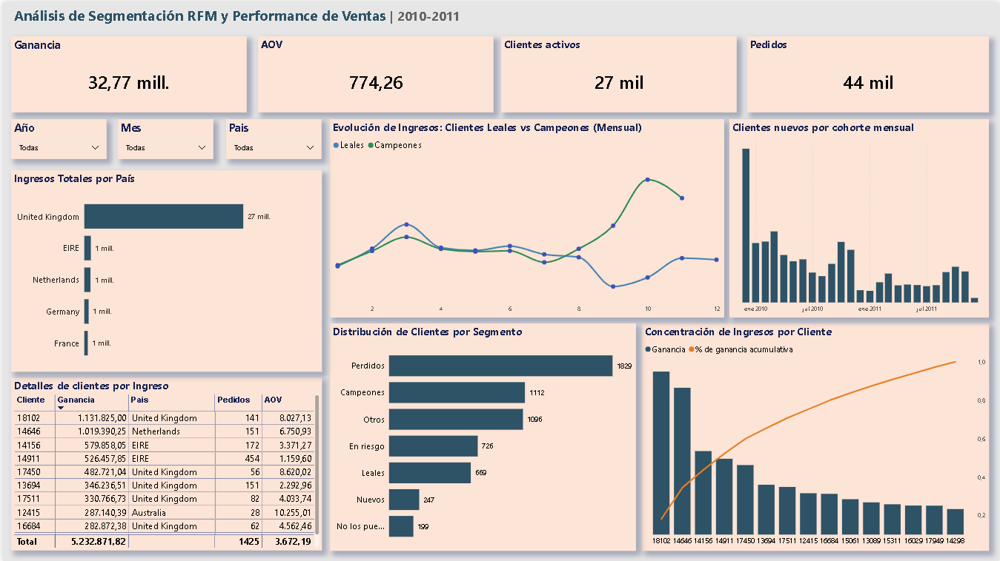
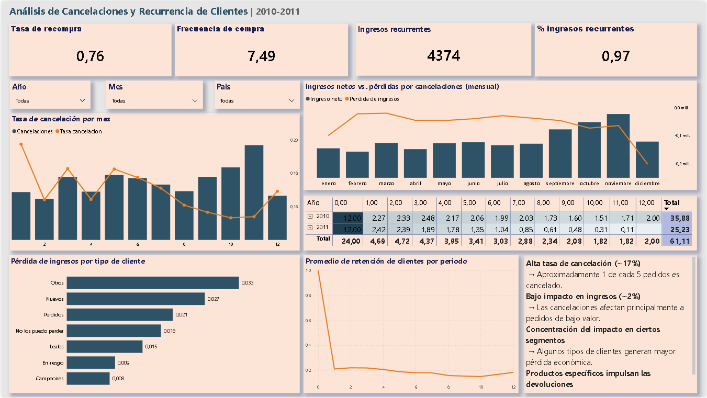

# Online Retail Analytics Project (SQL + Power BI)

Proyecto de análisis de datos de extremo a extremo sobre un minorista 
online del Reino Unido. Partiendo de datos transaccionales crudos, se 
construyó un data warehouse en PostgreSQL y un dashboard interactivo en 
Power BI orientado a la toma de decisiones comerciales.

## Objetivo

Identificar oportunidades de crecimiento, segmentos de clientes clave y 
patrones de retención a partir del comportamiento de compra real entre 
2009 y 2011.

## Dataset

- **Fuente:** [UCI Machine Learning Repository - Online Retail](https://archive.ics.uci.edu/ml/datasets/online+retail)
- **Alcance:** Transacciones históricas (Reino Unido) entre 2009 y 2011
- **Desafíos resueltos:** valores nulos en `CustomerID`, transacciones 
canceladas (prefijo `'C'`), registros con precios o cantidades negativos

## Tecnologías

| Herramienta | Uso |
|-------------|-----|
| PostgreSQL | ETL, modelado relacional, consultas analíticas |
| SQL | Window functions, cohortes, segmentación RFM, vistas |
| Power BI | Modelado DAX, visualización interactiva |

## Modelo de Datos (Star Schema)

Se transformó el dataset original en un esquema estrella para optimizar 
el rendimiento en Power BI:

- **Fact table:** `fact_sales` — transacciones, ingresos, cantidades
- **`dim_customers`** — identificadores y datos geográficos
- **`dim_products`** — catálogo y descripciones
- **`dim_date`** — jerarquías temporales (año, mes, trimestre, día)

## Análisis Realizados

- **Segmentación RFM** — clasificación de clientes por Recencia, 
Frecuencia y Valor Monetario usando window functions en SQL
- **Cohort Analysis** — tasa de retención mensual por cohorte de primera 
compra (períodos 0 a 12)
- **Análisis de Pareto** — concentración de ingresos por cliente
- **Análisis de cancelaciones** — impacto real de devoluciones sobre el 
margen neto por segmento de cliente
- **KPIs:** Revenue total, AOV, clientes activos, tasa de recompra, 
frecuencia de compra

## Dashboards

### Página 1 — Segmentación RFM y Performance de Ventas

### Página 2 — Cancelaciones y Recurrencia de Clientes

## Hallazgos

**Concentración de ingresos**
El cliente de mayor valor generó $1.13M en el período, y los 10 
principales clientes concentran una porción desproporcionada del revenue 
total. La curva de Pareto confirma una dependencia alta en un grupo 
reducido de compradores de alto valor.

**Retención crítica en el primer mes**
La tasa de retención cae de 100% a aproximadamente 20% entre el período 
0 y el período 1, independientemente de la cohorte. Eso significa que 4 
de cada 5 clientes no vuelven a comprar tras su primera transacción. La 
ventana de fidelización es el primer mes.

**Cancelaciones: alto volumen, bajo impacto económico**
Aproximadamente 1 de cada 5 pedidos es cancelado (~17%), pero el impacto 
en ingresos netos es de solo ~2%. Las cancelaciones se concentran en 
pedidos de bajo valor, con el segmento "Otros" generando la mayor pérdida 
absoluta.

**Clientes Campeones vs Leales**
Los Campeones superan consistentemente a los Leales en ingresos mensuales, 
con una brecha que se amplía hacia fin de año (pico en octubre-noviembre). 
Esto sugiere estacionalidad en el comportamiento de los compradores de 
mayor valor.

## Recomendaciones

1. **Programa de retención en el primer mes** — dado que la caída más 
grande ocurre entre la primera y segunda compra, una campaña de 
reactivación temprana (email, descuento en segunda compra) tiene el mayor 
potencial de impacto.

2. **Proteger a los Campeones** — 1.112 clientes en ese segmento generan 
una fracción desproporcionada del revenue. Un programa de fidelización 
diferenciado para ese grupo reduce el riesgo de concentración.

3. **Investigar cancelaciones por producto** — si ciertos productos 
concentran las cancelaciones, una revisión de calidad o descripción del 
producto puede reducir el volumen sin afectar la demanda real.

4. **Capitalizar la estacionalidad** — el pico de octubre-noviembre en 
clientes de alto valor sugiere preparar campañas de retención y cross-sell 
antes de ese período, no durante.

## Estructura del Repositorio
* /sql: Scripts de creación de tablas, vistas y análisis de cohortes.
* /data: Documentación sobre el origen de los datos.
* /dashboard: Archivo .pbix con las visualizaciones finales.

## Cómo Utilizar este Repositorio
1. Datos: Descarga el dataset de la fuente UCI y cárgalo en tu instancia de PostgreSQL.
2. Scripts SQL: Ejecuta los scripts para crear el esquema, limpiar los datos y generar las vistas analíticas.
3. Power BI: Abre el archivo .pbix y actualiza la conexión a tu base de datos para visualizar el dashboard.
